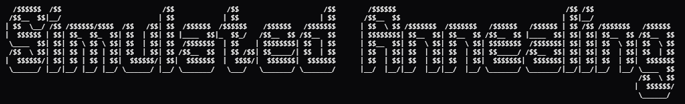

  

    A C implementation of the Simulated Annealing metaheuristic algorithm designed for academic research, optimization problems, and experimentation with stochastic search methods.

    
    
    
    
    
    

---

## License
This project is licensed under the [MIT License](./LICENSE).

## Authors
- [Sedkeee](https://github.com/Sedkeee)
- [Yenterick](https://github.com/Yenterick)

## References
Kernighan, B. W., & Ritchie, D. M. (1988). *The C Programming Language*. Prentice Hall.
Glover, F. W., & Kochenberger, G. A. (2003). *Handbook of Metaheuristics*. Springer.
Cormen, T. H. (2013). *Algorithms Unlocked*. MIT Press.

